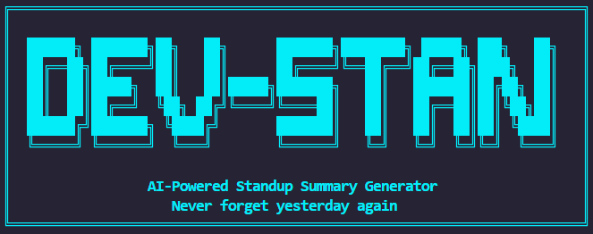
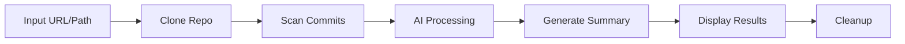

<div align="center">



<!-- <p align="center">
  <b>AI-Powered Standup Summary Generator</b><br>
  Never forget what you did yesterday
</p> -->

<p align="center">
  <a href="#features">Features</a> •
  <a href="#installation">Installation</a> •
  <a href="#usage">Usage</a> •
  <a href="#examples">Examples</a> •
  <a href="#documentation">Documentation</a>
</p>

<p align="center">
  
  
  
  
</p>

</div>

---

## Overview

**Dev-Standup** is a powerful CLI tool that automatically scans git commits from any repository and uses local AI to generate human-readable standup summaries. No more forgetting what you worked on yesterday!

### Why Dev-Standup?

- **Local AI** - Runs 100% locally with Ollama (free, no API keys!)
- **GitHub Integration** - Just paste a repo URL, we handle the rest
- **Smart Summaries** - AI understands your commits and groups related work
- **Three Modes** - Professional, Sarcastic, or Epic summaries
- **Privacy-First** - Your code never leaves your machine

## Features

| Feature | Description |
|---------|-------------|
| **Local AI** | Uses Ollama - 100% free, no API keys needed |
| **GitHub URLs** | Auto-clones repos from GitHub URLs |
| **Multi-Repo** | Scan entire workspaces with multiple projects |
| **Time Ranges** | Flexible time windows (24h, 48h, custom) |
| **Mood Modes** | Neutral, Roast, or Hero summaries |
| **Space Efficient** | Shallow clones with automatic cleanup |
| **Beautiful CLI** | Modern terminal interface with colors |

## Installation

### Quick Start

```bash
# 1. Install dependencies
pip install -e .

# 2. Install Ollama
# Download from: https://ollama.com/download

# 3. Pull AI model
ollama pull llama2

# 4. Start Ollama server
ollama serve
```

### Requirements

- Python 3.8+
- Git
- Ollama (for local AI) or OpenAI API key

## Usage

### Basic Commands

```bash
# Scan any GitHub repository
python run.py --repo https://github.com/user/repo --all-authors

# Scan local repository
python run.py --repo /path/to/repo --all-authors

# Scan current directory
python run.py --all-authors
```

### Mood Modes

```bash
# Professional summary
python run.py --repo https://github.com/user/repo --all-authors

# Sarcastic roast mode
python run.py --repo https://github.com/user/repo --all-authors --mood roast

# Epic hero mode
python run.py --repo https://github.com/user/repo --all-authors --mood hero
```

### Advanced Options

```bash
# Last 48 hours
python run.py --repo https://github.com/user/repo --all-authors --hours 48

# Scan all repos in directory
python run.py --all-repos --all-authors

# Use OpenAI instead of Ollama
python run.py --repo https://github.com/user/repo --provider openai
```

## Examples

### Neutral Mode

```
╔═══════════════════════════════════════════════════════════════════════╗
║                         STANDUP SUMMARY                               ║
╚═══════════════════════════════════════════════════════════════════════╝

• Implemented user authentication with JWT tokens
• Fixed bug in payment processing workflow
• Updated API documentation for new endpoints
• Refactored database query optimization
```

### Roast Mode

```
╔═══════════════════════════════════════════════════════════════════════╗
║                         STANDUP SUMMARY                               ║
╚═══════════════════════════════════════════════════════════════════════╝

• 'Fixed' yet another bug. Wonder how it got there...
• Committed unfinished work. Living dangerously!
• "WIP" - such a descriptive commit message! 10/10
```

### Hero Mode

```
╔═══════════════════════════════════════════════════════════════════════╗
║                         STANDUP SUMMARY                               ║
╚═══════════════════════════════════════════════════════════════════════╝

• Slayed the Authentication Dragon with the Sacred JWT Shield!
• Vanquished the Payment Processing Demon!
• Inscribed the API Scrolls for future heroes!
```

## Command Reference

| Option | Description | Default |
|--------|-------------|---------|
| `--repo URL/PATH` | GitHub URL or local path | Current directory |
| `--mood MODE` | neutral, roast, or hero | neutral |
| `--hours N` | Hours to look back | 24 |
| `--all-authors` | Include all users' commits | Only you |
| `--all-repos` | Scan all repos in directory | Single repo |
| `--provider NAME` | ollama or openai | ollama |

## Configuration

Create a `.env` file (optional):

```env
LLM_PROVIDER=ollama
OLLAMA_MODEL=llama2
DEFAULT_MOOD=neutral
DEFAULT_HOURS=24
```

## Documentation

- **[Installation Guide](OLLAMA_SETUP.md)** - Detailed Ollama setup instructions
- **[Quick Start](QUICKSTART.md)** - Quick reference guide
- **[Contributing](#contributing)** - How to contribute

## Troubleshooting

<details>
<summary><b>"Cannot connect to Ollama"</b></summary>

Run `ollama serve` in a separate terminal. Ollama must be running to generate summaries.

```bash
ollama serve
```
</details>

<details>
<summary><b>"ollama: command not found"</b></summary>

Restart your terminal after installing Ollama. If still not working:

```powershell
& "$env:LOCALAPPDATA\Programs\Ollama\ollama.exe" --version
```
</details>

<details>
<summary><b>"No commits found"</b></summary>

- Add `--all-authors` to include everyone's commits
- Try longer range: `--hours 48`
- Check git email: `git config user.email`
</details>

See **[OLLAMA_SETUP.md](OLLAMA_SETUP.md)** for complete troubleshooting guide.

## How It Works



1. **Input** - GitHub URL or local path
2. **Clone** - Shallow clone to temp (if URL)
3. **Scan** - Extract commits from time range
4. **AI Process** - Send to Ollama with context
5. **Output** - Beautiful formatted summary
6. **Cleanup** - Auto-delete temp files

## Architecture

```
Dev-Standup/
├── dev_standup/
│   ├── cli.py              # CLI interface
│   ├── git_scanner.py      # Git operations
│   ├── summarizer.py       # LLM integration
│   ├── github_utils.py     # GitHub handling
│   ├── prompts.py          # AI prompts
│   └── config.py           # Configuration
├── assets/                 # Images & media
├── README.md               # This file
└── OLLAMA_SETUP.md         # Setup guide
```

## Contributing

Contributions are welcome! Here's how:

1. Fork the repository
2. Create a feature branch (`git checkout -b feature/amazing`)
3. Commit your changes (`git commit -m 'Add feature'`)
4. Push to the branch (`git push origin feature/amazing`)
5. Open a Pull Request

### Ideas for Contributions

- Add more mood modes (zen, pirate, shakespear...)
- Support GitLab/Bitbucket
- Commit categorization (features/bugs/docs)
- Interactive mode
- Export to Markdown/JSON
- Tests & CI/CD

## License

MIT License - See [LICENSE](LICENSE) for details

## Built With

- [Ollama](https://ollama.ai) - Local LLM runtime
- [GitPython](https://gitpython.readthedocs.io/) - Git integration
- [Click](https://click.palletsprojects.com/) - CLI framework
- [Colorama](https://github.com/tartley/colorama) - Terminal colors

## Acknowledgments

Special thanks to:
- The Ollama team for making local AI accessible
- Everyone who contributed ideas and feedback
- Tea, for making this project possible

---

<div align="center">

**Made with ❤️ for developers who can't remember yesterday**

[⬆ Back to Top](#dev-standup-automator)

</div>
